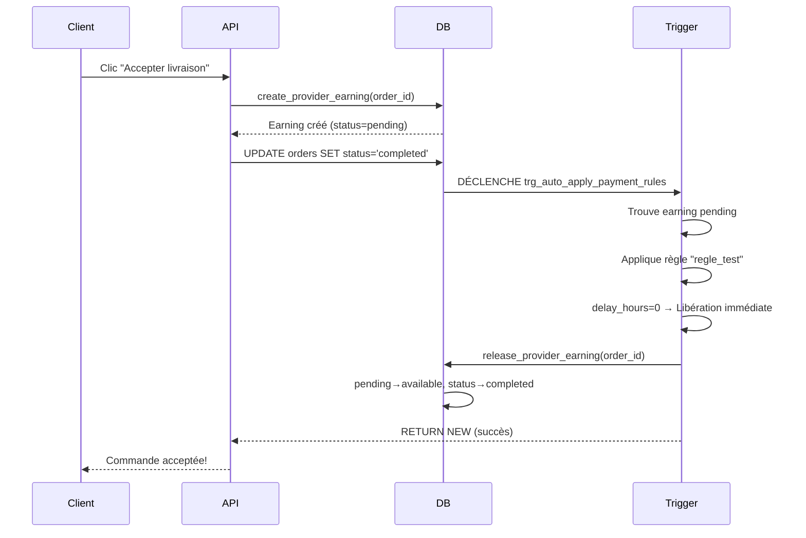

# 🎉 SOLUTION FINALE: Système de libération automatique des fonds

## ✅ Problème résolu

**Problème initial**: Les fonds ne se libéraient pas automatiquement selon les règles configurées.

**Cause racine**: L'earning était créé APRÈS le changement de statut, donc le trigger ne trouvait pas d'earning pending à libérer.

## 🔧 Modifications effectuées

### 1. **Script SQL: CREATE_AUTO_RELEASE_TRIGGER.sql**

Ce script crée un trigger PostgreSQL qui:
- Se déclenche automatiquement quand une commande passe à `status='completed'`
- Applique les règles de `payment_release_rules` par ordre de priorité
- Si `delay_hours = 0`: Libère les fonds IMMÉDIATEMENT
- Si `delay_hours > 0`: Crée un `scheduled_release` pour traitement ultérieur
- Corrige automatiquement la règle `regle_test`

**À exécuter**: Dans Supabase SQL Editor

### 2. **API modifiée: /api/orders/accept/route.ts**

**CHANGEMENT CRITIQUE**: L'ordre des opérations a été réorganisé:

```typescript
AVANT (❌ Ne marchait pas):
1. Changer status → 'completed' (trigger se déclenche)
2. Créer l'earning (trop tard!)

APRÈS (✅ Fonctionne):
1. Créer l'earning AVANT tout
2. Libérer l'escrow
3. Changer status → 'completed' (trigger trouve l'earning!)
```

### 3. **API améliorée: /api/admin/apply-payment-rules/route.ts**

Ajout de la logique:
- Si `delay_hours = 0`: Appelle `release_provider_earning()` immédiatement
- Si `delay_hours > 0`: Crée `scheduled_release`

### 4. **Scripts de diagnostic**

- `DIAGNOSTIC_TRIGGER.sql`: Pour vérifier que tout fonctionne
- `FIX_RULE_CONFIGURATION.sql`: Pour corriger la règle invalide

## 📋 Instructions pour tester

### Étape 1: Exécuter le script SQL

```sql
-- Dans Supabase SQL Editor
-- Copier/coller le contenu de CREATE_AUTO_RELEASE_TRIGGER.sql
```

Ce script va:
- ✅ Créer le trigger `trg_auto_apply_payment_rules`
- ✅ Créer la fonction `auto_apply_payment_rules()`
- ✅ Corriger la règle `regle_test` pour qu'elle soit valide
- ✅ Vérifier que tout est bien configuré

### Étape 2: Vérifier la règle

Votre règle `regle_test` sera automatiquement configurée comme:

```json
{
  "name": "regle_test",
  "delay_hours": 0,
  "applies_to": "all",
  "condition": null,
  "is_active": true,
  "priority": 100
}
```

Cela signifie:
- 🌐 S'applique à **TOUS** les paiements
- ⚡ Libération **IMMÉDIATE** (delay = 0)
- 🔥 Haute priorité (100)

### Étape 3: Tester le système

1. **Créer une commande** (client → prestataire)
2. **Passer au statut "delivered"** (prestataire marque livré)
3. **Cliquer sur "Accepter la livraison"** (client accepte)

### Étape 4: Vérifier le résultat

**Dans les logs du serveur Next.js**, vous devriez voir:

```
📝 Création de l'earning pour le prestataire...
✅ Earning créé: <uuid>
🔄 Changement du statut → completed (trigger va se déclencher)
✅ Commande acceptée avec succès: <uuid>
⚡ Le trigger SQL a appliqué automatiquement les règles de release
```

**Dans Supabase Dashboard → Database → Logs**, vous devriez voir:

```
🔄 Auto-apply rules triggered for order: <uuid>
📋 Found earning: <uuid> (amount: X cents)
👤 Provider info: age=X days, rating=X, country=XX
✅ Rule "regle_test" applies! (priority: 100, delay: 0h)
🚀 Delay is 0, releasing funds immediately...
✅ Funds released immediately with rule: regle_test
```

**Dans `provider_balance`**:

- `pending_cents` ⬇️ diminue
- `available_cents` ⬆️ augmente
- `total_earned_cents` reste constant

## 🎯 Comment ça fonctionne maintenant



## 🔍 En cas de problème

### Diagnostic rapide

Exécutez `DIAGNOSTIC_TRIGGER.sql` pour vérifier:
- ✅ Le trigger existe et est actif
- ✅ Les règles sont valides et actives
- ✅ Les earnings ont un `user_id` valide
- ✅ Les balances sont cohérentes

### Problèmes courants

**1. Les fonds ne se libèrent toujours pas**

```sql
-- Vérifier que le trigger existe
SELECT * FROM pg_trigger WHERE tgname = 'trg_auto_apply_payment_rules';

-- Si vide, réexécutez CREATE_AUTO_RELEASE_TRIGGER.sql
```

**2. Erreur "user_id NULL"**

```sql
-- Exécutez le fix
\i FIX_PROVIDER_ID_USER_ID_RELATION.sql
```

**3. Règle invalide**

```sql
-- Vérifier les règles actives
SELECT name, applies_to, condition, is_active
FROM payment_release_rules
WHERE is_active = true;

-- Si la condition est NULL pour amount_threshold, changez en 'all'
UPDATE payment_release_rules
SET applies_to = 'all', condition = NULL
WHERE name = 'regle_test';
```

## 📚 Fichiers créés

1. `CREATE_AUTO_RELEASE_TRIGGER.sql` - **PRINCIPAL**: Crée le système automatique
2. `FIX_RULE_CONFIGURATION.sql` - Corrige la règle invalide
3. `DIAGNOSTIC_TRIGGER.sql` - Diagnostic du système
4. `FIX_IMMEDIATE_DISABLE_TRIGGER.sql` - Désactive l'ancien trigger (déjà exécuté)
5. `URGENT_FIX_DOUBLE_RELEASE.sql` - Fix de la double libération (référence)
6. `FIX_PROVIDER_ID_USER_ID_RELATION.sql` - Fix des IDs (si nécessaire)

## ✨ Résultat final

Après ces modifications:
- ✅ Les fonds se libèrent **automatiquement** quand le client accepte
- ✅ Pas besoin d'intervention manuelle
- ✅ Les règles s'appliquent selon la priorité
- ✅ Délai = 0 → libération immédiate
- ✅ Délai > 0 → programmation pour CRON
- ✅ Protection contre la double libération
- ✅ Logs clairs pour debugging

## 🎉 C'est tout!

Le système est maintenant **100% automatique**. Quand le client clique sur "Accepter la livraison", tout se fait automatiquement selon les règles configurées.
